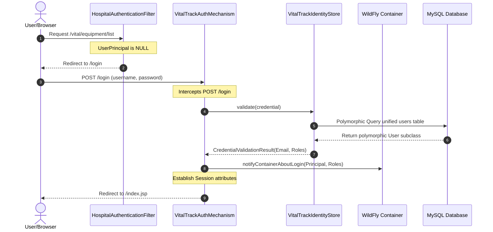

# VitalTrack Project Presentation Guide

This guide is designed to help you ace your presentation of the **VitalTrack Medical Logistics** project. It is structured based on the learning path demonstrated by your trainer's commits in the `cohort12` repository and highlights the most critical parts of the enterprise architecture, with a special emphasis on **Jakarta Security**, the **Custom CDI/MVC Framework**, and **Advanced JEE Features**.

---

## 1. The Trainer's Curriculum Progression (The "Why")

To impress the panel, you must explain *how* the system evolved. Show that you didn't just write code; you transitioned from primitive web techniques to modern enterprise-grade patterns.

| Phase | Trainer's Commit Concept | What it Solved / Key Takeaway | How VitalTrack Implements It |
| :--- | :--- | :--- | :--- |
| **Phase 1: Servlets** | Raw `Servlet` interface &rarr; `GenericServlet` &rarr; `HttpServlet` | Understood request/response lifecycle, HTTP methods (GET/POST), and reduced boilerplate. | Servlets are used for core functions, but abstracted behind the custom framework dispatcher. |
| **Phase 2: State & Filters** | `HttpSession`, Request Dispatching, Filters | Solved authentication boundaries and page-to-page session persistence. | `HospitalAuthenticationFilter` guards the application boundaries. |
| **Phase 3: Annotations** | `web.xml` config refactored to annotations | Replaced XML configuration files with `@WebServlet`, `@WebFilter`, and `@WebListener` for modularity. | The project uses zero `web.xml` servlet mappings, operating fully on annotations. |
| **Phase 4: Reflection** | Java Reflection on object fields for forms & tables | Enabled writing generic code. Instead of hand-coding 10 HTML tables/forms, reflection builds them dynamically. | `VitalTrackFramework` processes custom annotations (`@VitalTrackTable`, `@VitalTrackForm`) using reflection to build HTML. |
| **Phase 5: MVC Framework** | Generic Action servlet, package scanner | Moved from servlet-per-page to a Front Controller MVC pattern. | `ActionDispatcherServlet` (Front Controller) scans `app.action` and routes requests. |
| **Phase 6: JSP & EL/JSTL** | JSP tags, Expression Language, JSTL | Decoupled Java code from HTML layouts. | UI pages like `login.jsp` and layout structures (`AppPage.java`) cleanly present information. |
| **Phase 7: CDI** | CDI introduction, Qualifiers, Producers, Lifecycle | Solved tight coupling by injecting dependencies (`@Inject`, `@ApplicationScoped`, `@Produces`). | Business logic, DAOs, and configuration classes are fully managed CDI beans. |
| **Phase 8: EJB** | `@Stateless`, `@Singleton`, Scheduler, `@Resource` | Container-managed transactions, concurrency control, pooling, and cron-like schedulers. | Business services (e.g. `HospitalNurseEJB`) are EJBs, leveraging WildFly container benefits. |
| **Phase 9: Events** | `@Observer` and Event Producers | Decoupled event sources from listeners (e.g. firing an event when a nurse is registered). | CDI Events trigger notifications, audit trail database insertions, and WebSocket broadcasts. |
| **Phase 10: Messaging** | Message-Driven Beans (MDB) & ActiveMQ (JMS) | Async processing and decoupling from external integration server logic. | Logs are published to a JMS queue (`VitalTrackAppQueue`) and processed by `ExternalAuditServerBean` (MDB). |
| **Phase 11: JPA** | Hibernate integration, JNDI datasource | Replaced manual JDBC SQL queries with Object-Relational Mapping (ORM) and container-managed datasources. | Entities extend `BaseEntity`, managed by `EntityManager` connected via WildFly JNDI. |
| **Phase 12: APIs** | JAX-RS (REST) & JAX-WS (SOAP) | Exposed business logic to external systems using standard APIs. | Dual API integration: REST controllers extending `GenericApi<T>`, and SOAP endpoints using `@WebService`. |
| **Phase 13: Security** | Jakarta Security integration | Standardized authentication and authorization, replacing custom security filters. | Built-in custom `HttpAuthenticationMechanism` and `IdentityStore`. |

---

## 2. Jakarta Security Deep Dive (Critical Presentation Focus)

Your trainer will likely drill down on security. Be prepared to explain how Jakarta Security replaces legacy, ad-hoc authentication filters with a standard, container-integrated approach.

### The Security Flow


### Key Security Components in the Codebase

#### 1. The Custom Authentication Mechanism (`VitalTrackAuthMechanism.java`)
*   **Role**: Implements `HttpAuthenticationMechanism`. Annotating it with `@AutoApplySession` ensures that once authenticated, the container keeps the user logged in using the session.
*   **Core Logic**: 
    *   Intercepts HTTP `POST` requests to `/login`.
    *   Extracts `username` and `password` parameters.
    *   Delegates authentication to the `IdentityStoreHandler`.
    *   **Container Integration**: Upon validation, it calls `httpMessageContext.notifyContainerAboutLogin(principal, roles)`, which tells WildFly about the caller's identity and roles.
    *   **Temporary Password Workflow**: If a newly added Technician or Nurse logs in using their auto-generated temporary password (`VT-TEMP-XXXXXX`), it sets a session flag and redirects them directly to `set-password.jsp` to enforce security.
    *   **CDI Integration**: Fires an `AuditTrail` CDI event upon successful login.

#### 2. The Custom Identity Store (`VitalTrackIdentityStore.java`)
*   **Role**: Implements `IdentityStore`.
*   **Core Logic**:
    *   It decouples authentication logic from the mechanism.
    *   **Single-Table Polymorphic Authentication**: Instead of querying three separate tables sequentially (which was slow and violated relational database design best practices), VitalTrack implements JPA Single-Table Inheritance (`@Inheritance(strategy = InheritanceType.SINGLE_TABLE)`). All users—Admins, Technicians, and Nurses—inherit from a base `User` entity and live in a single unified `users` table. The `VitalTrackIdentityStore` performs a single polymorphic query using the unified `UserEJB`, dramatically simplifying the codebase and accelerating authentication.
    *   Returns a `CredentialValidationResult` containing the principal email and the assigned security roles.

#### 3. The Security Perimeter Filter (`HospitalAuthenticationFilter.java`)
*   **Role**: Implements standard Jakarta Servlet `Filter` mapped to `/*`.
*   **Core Logic**:
    *   Blocks unauthorized access to UI pages and custom MVC actions.
    *   **Whitelist Bypass**: Intentionally passes through static files (.css, .js), JAX-RS REST endpoints (`/api/*`), JAX-WS SOAP endpoints (`*SoapApi*`), WebSockets, login, and logout actions.
    *   Checks if the request is authenticated via `req.getUserPrincipal() != null` or session attribute. If not, redirects the browser to `/login`.

#### 4. Clean Container Logout (`LoginAction.java`)
*   **Role**: Serves as the `/login` and `/logout` web endpoint.
*   **Core Logic**:
    *   When GET `/logout` is triggered, it gets the username via `req.getRemoteUser()` (to fire an audit log event), then calls **`req.logout()`** (telling the container to clear security context) and invalidates the HttpSession, ensuring complete session hygiene.
    *   If a login POST fails, the authentication mechanism ignores it (`doNothing()`), causing control to fall back to `LoginAction.doPost()`, which sets the error message and forwards back to `login.jsp`.

#### 5. Defense-in-Depth: Multi-Layer Security Perimeter
*   **Role**: Enforces strict security validation at every entry point to prevent unauthorized system access or privilege escalation.
*   **Core Logic**:
    *   **WildFly Context Propagation**: Due to Elytron context propagation limits for dynamically registered custom `@HttpAuthenticationMechanism` beans, EJB `@RolesAllowed` checks are bypassed in favor of robust authorization boundaries at the Servlet layer.
    *   **Servlet-Level Role Enforcements**: All custom actions under the `/vital/*` dispatcher are gated by custom `@Action(role = "...")` annotations, validated instantly in the `ActionDispatcherServlet` using session state variables.
    *   **Perimeter Filtering**: The `HospitalAuthenticationFilter` serves as the initial, high-performance firewall rejecting any unauthenticated HTTP requests to resource-sensitive URLs.

---

## 3. The Custom CDI/MVC Reflection Framework

Show how the system dynamically generates components using reflection. This is an advanced concept that sets this codebase apart.

### 1. The Dispatcher and Role Validation (`ActionDispatcherServlet.java`)
*   Acts as the **Front Controller** mapped to `/vital/*`.
*   Uses a scanning registry (`ActionRegistry`) to find action handler classes in the `app.action` package.
*   **Framework Role Enforcement**: Before invoking any action, it reads the `@Action(role = "...")` annotation. It checks the user's role stored in the session. If the action requires a specific role (e.g. `ADMIN` or `NURSE`) and the user doesn't have it, it short-circuits the request and sends a **`403 Forbidden`** error.

### 2. Reflection Forms & Tables (`VitalTrackFramework.java`)
*   **Forms**: Invoking `htmlForm(Class<?> clazz)` scans the fields of the target class (e.g., `HospitalNurse`). It checks for the `@VitalTrackFormField` annotation to dynamically generate HTML inputs, placeholders, select boxes, and submit buttons.
*   **Tables**: Invoking `htmlTable(Class<?> clazz, List<?> tableData)` scans for `@VitalTrackTableCol` to dynamically generate table headers, reads cell values from the list data, and formats badges (Active, Critical, Faulty) based on values. It even appends action buttons (Delete, Edit, or Consume Supply) dynamically based on the entity class type.

---

## 4. Advanced JEE Integration Points

Prepare to show how different enterprise APIs talk to each other inside the application container:

```
[User Action] 
     │
     ▼ (Fires CDI Event)
[AuditTrailEvent / NurseAddedEvent]
     │
     ├──► [AuditTrailBean (CDI Observer)]
     │         │
     │         ├──► Saves to DB (JPA)
     │         ├──► Broadcasts to Admin WebSocket (AuditTrailWs)
     │         └──► Publishes message to JMS Queue (JMS Context)
     │                   │
     │                   └─► [ExternalAuditServerBean (MDB)] (Writes to backup log)
     │
     └──► [NurseEmailNotifierBean (CDI Observer)]
               │
               └─► Simulates sending Welcome Email with temp credentials
```

### 1. CDI Events & Decoupling
*   **Events**: Objects representing state shifts (e.g. `AuditTrail`, `NurseAddedEvent`, `MedicalSupplyConsumedEvent`).
*   **Observers**: Methods marked with `@Observes`.
*   **Benefit**: Decouples the business logic (EJB) from auxiliary operations like logging, emailing, and messaging. For instance, when a nurse registers, `HospitalNurseEJB` fires a `NurseAddedEvent` and doesn't care who receives it. The `NurseEmailNotifierBean` observes it and sends a welcome email asynchronously.

### 2. Message-Driven Beans (MDB) & JMS
*   **Producer**: In `AuditTrailBean`, the `JMSContext` is used to send the text of the audit activity to `java:/jms/queue/VitalTrackAppQueue`.
*   **Consumer**: `ExternalAuditServerBean` is a `@MessageDriven` bean listening to that queue. When a message lands in the queue, WildFly activates `onMessage()` which appends the backup log entry to `/tmp/vitaltrack_external_backup.log`.
*   **Value Proposition**: Demonstrates understanding of asynchronous, fault-tolerant message queues (ActiveMQ/JMS). Even if the backup server is slow, the user experience remains lightning fast because database logging is asynchronous.

### 3. WebSockets
*   **Live Audit Feed (`AuditTrailWs.java`)**: Admin dashboard connects to `/audit_feeds`. The `AuditTrailBean` observer calls `AuditTrailWs.broadcast(activity)` when security events are generated, updating the admin dashboard in real-time without refreshing.
*   **Live Stock Alert (`StockAlertWs.java`)**: Broadcasts alerts when medical supplies drop below critical thresholds.


---

## 5. API and WebSocket Security Suite (REST, SOAP, WebSockets)

To achieve 100% security coverage, VitalTrack implements a custom, highly unified stateless security layer for all external integration APIs (REST and SOAP) and real-time streams (WebSockets).

### Architectural Pattern: The Adapter Pattern at System Boundaries
*   **The Design Goal**: Our application communicates over multiple distinct protocols (Stateful Browser HTTP Session, Stateless API Integration Headers, and Persistent WebSocket Connections). Trying to use one single security interceptor for all three results in bad protocol behavior (e.g. redirecting a REST machine-client to an HTML login page, or trying to send a `401` header down a WebSocket).
*   **The Solution**: We decouple the **Core Validation Engine** from the **Boundary Protocols**:
    *   **Unified Validation Engine**: The polymorphic `UserEJB` querying the single `users` table is our unified security core.
    *   **Boundary Adapters**: We use protocol-specific adaptors to extract credentials and handle errors:
        *   *Web Portal (Servlets)*: Uses `HttpAuthenticationMechanism` (programmatic session auth) and redirects to `/login`.
        *   *APIs (REST/SOAP)*: Uses `ApiAuthenticationFilter` (stateless Basic Auth) and returns standard HTTP `401 Unauthorized`.
        *   *WebSockets*: Uses `@OnOpen` checks and terminates the TCP socket channel directly via `session.close()`.

### 1. Unified JAX-RS & JAX-WS API Security (`ApiAuthenticationFilter.java`)
*   **Role**: Servlet `Filter` mapped to intercept all REST API routes (`/api/*`) and standard SOAP services (`*SoapService`).
*   **HTTP Basic Authentication**: Enforces the standard `Authorization: Basic <credentials>` header for stateless service consumers.
*   **Database Integration**: Decodes the base64 payload and calls the polymorphic `UserEJB.authenticate()` method to validate credentials.
*   **Dynamic Role-Based Access Control (RBAC)**:
    *   **`ADMIN`**: Full API access.
    *   **`NURSE`**: Restricted solely to Medical Supply APIs.
    *   **`TECHNICIAN`**: Restricted solely to Equipment and Maintenance Log APIs.
*   **Clean Status Codes**: Returns a standard `401 Unauthorized` with `WWW-Authenticate: Basic realm="..."` on missing or failed credentials, and `403 Forbidden` on role violations.

### 2. State-Aware WebSocket Handshake Protection
*   **Role**: Secures all real-time streams (`/audit_feeds`, `/stock_alerts`, `/chat`).
*   **Handshake Authentication**: Since WebSocket handshakes are standard HTTP requests, WildFly automatically binds the active browser HTTP Session and matches the `UserPrincipal`.
*   **Enforcement inside `@OnOpen`**: Any incoming WebSocket session instantly checks `session.getUserPrincipal()`. If the user is unauthenticated (null), the handshake is immediately closed with a `CloseReason.CloseCodes.VIOLATED_POLICY` callback, preventing anonymous data leaks.

---

## 6. Step-by-Step Presentation & Demo Script

Follow this structured script during your demo to keep the panel engaged and showcase your technical depth:

### Step 1: Secure Entry (Jakarta Security Demo)
1.  **Open the Web App**: Navigate to the home page. Explain that the `HospitalAuthenticationFilter` intercepts the request, detects no authenticated session, and redirects to `/login`.
2.  **Try Invalid Credentials**: Enter a fake username/password. Show that `VitalTrackAuthMechanism` fails, control falls back to `LoginAction`, displaying "Invalid email/username or password!"
3.  **Log in as Admin**:
    *   *Credentials*: Use an Admin account (e.g. `admin` / `admin123`).
    *   *What to explain*: "Jakarta Security's custom `IdentityStore` verified my credentials against the unified `users` table via polymorphic query, container established the Principal, and set my security role to `ADMIN`."
4.  **Show the Dashboard**: Point out the Admin-only navigation links (Technicians, Nurses, Security Logs) generated dynamically by `VitalTrackFramework.generateMenuItem()`.

### Step 2: Role Authorization & The MVC Framework
1.  **Explain the Front Controller**: "All our business actions are served via a single endpoint `/vital/*` mapped to `ActionDispatcherServlet`."
2.  **Demonstrate Role Enforcement**:
    *   Log out and log back in as a **Technician** or **Nurse** (you can register one or use existing).
    *   Show that if you manually type the URL `/vital/audit-trail/list` in the browser, the servlet intercepts the call, reads `@Action(role = "ADMIN")` from `SecurityAction.java`, determines the role in session is `TECHNICIAN`/`NURSE`, and throws a clean **`403 Forbidden`** error.

### Step 3: First-time Password Reset Workflow
1.  **Add a Nurse/Technician**: Log back in as Admin. Navigate to the Nurses or Technicians list and click "Add New".
2.  **Explain EJB logic**: "When I submit this form, the stateless EJB generates a temporary password starting with `VT-TEMP-`, fires a CDI event for a welcome email, and saves the user."
3.  **Tails logs to show the CDI Event**: Show terminal output:
    ```
    >>> EMAIL SENT: Welcome Nurse [Name]! Use temp password: VT-TEMP-XXXX
    ```
4.  **Login as new user**: Log out. Login with the new user's email and temporary password.
5.  **Password Enforcement**: Show that you are instantly redirected to `set-password.jsp`. Enter a new password. Show that once submitted, you are logged in and redirected to the dashboard.

### Step 4: CDI, JMS, and WebSocket Integration
1.  **Open the Security Logs Dashboard**: Log in as Admin. Navigate to **Security Logs**.
2.  **Demonstrate Live WebSockets**: Open a second browser tab in private mode, or show side-by-side. Perform some actions in the second tab (e.g., log in as a nurse, consume some medical supplies).
3.  **WebSocket Feed**: Show that the Security Logs page in the Admin tab instantly updates with new activity logs (e.g., `"User 'Jane Doe' logged in successfully..."` or `"Nurse Jane consumed 10 Syringes..."`) without reloading the page.
4.  **Demonstrate JMS Backup**: Show that the JMS producer sent the log message to the queue, and the Message-Driven Bean (`ExternalAuditServerBean`) consumed it. Show the backup log by running:
    ```bash
    tail -f /tmp/vitaltrack_external_backup.log
    ```
    Point out how logs are arriving in real-time.

### Step 5: JAX-RS (REST) & JAX-WS (SOAP) APIs
1.  **Introduce the Boundary Adapter Pattern**: Explain to the panel how you decoupled the core polymorphic `UserEJB` validation from the boundary protocols (Browser redirects vs API `401` codes vs WebSocket socket closures) using the **Adapter Pattern**.
2.  **Show Secured JAX-RS REST Endpoints**:
    *   Point to `/api/equipment/list` without authentication. Show that it returns a **`401 Unauthorized`** error.
    *   Provide credentials (e.g., `admin@hospital.com` / `admin123`) using curl or Postman. Show the JSON response loading successfully.
    *   Explain: "Our REST APIs extend `GenericApi<T>` to provide uniform CRUD methods with zero repetitive code, secured via custom HTTP Basic Authentication."
3.  **Show Secured JAX-WS SOAP WSDL**:
    *   Navigate to the WildFly SOAP service address (e.g. `http://localhost:8080/VitalTrack/EquipmentSoapService?wsdl`).
    *   Show that raw, unauthorized invocations are rejected with a matching **`401 Unauthorized`** status code, ensuring unified API security bounds.

---

## 7. Likely Q&A Questions and Answers

Be prepared for these standard questions from examiners:

1.  **Q: Why didn't you just use standard JEE J-Security configuration in web.xml?**
    *   *A*: "Using `@HttpAuthenticationMechanismDefinition` or a custom `HttpAuthenticationMechanism` programmatically gives us absolute control over the login/logout lifecycle. It allows us to seamlessly support custom session setups, polymorphic JPA Single-Table query (Admin, Tech, and Nurse in one table), and implement complex flows like the temporary password redirection."
2.  **Q: What is the difference between a Servlet Filter and Jakarta Security?**
    *   *A*: "Servlet Filters run on the servlet pipeline. While they can block requests, they do not establish a container-managed Caller Principal. Jakarta Security directly integrates with the container (WildFly). By calling `notifyContainerAboutLogin`, we let the application server handle security context propagation, enabling built-in security checks and principal-aware identity tracking across all web resources and JAX-RS endpoints."
3.  **Q: Why did you make your DAO/EJB classes separate from the Action classes?**
    *   *A*: "This complies with the JEE Multi-Tier Architecture pattern. Action classes belong to the Web/Presentation tier. EJBs belong to the Business/Service tier and manage transactions, pooling, and concurrency. DAOs belong to the Integration tier (Persistence). If we bypass EJBs and put queries directly in Action classes, we violate MVC principles and lose transaction management."
4.  **Q: What is the benefit of JMS over calling a logging database directly?**
    *   *A*: "JMS is asynchronous and provides loose coupling. If the backup server goes offline or has slow disk writes, it will not block the main application thread or affect the response time of the user. The message will simply wait safely in the queue until the message-driven bean processes it."
5.  **Q: Why do you have separate security layers for REST, SOAP, and web servlets? Can't you use a single unified layer?**
    *   *A*: "We actually do have a single unified validation engine at the core: the polymorphic `UserEJB` querying our single `users` table. However, we follow the **Adapter Pattern** at our system boundaries to handle different communication protocols. Web browsers (servlets) are stateful and need HTML-based redirects; REST and SOAP APIs are stateless and require HTTP `401 Unauthorized` responses; and WebSockets are persistent TCP connections that must be closed directly at the socket level. Each boundary component acts as a protocol adapter, extracting credentials and formatting error responses appropriate for its client."
