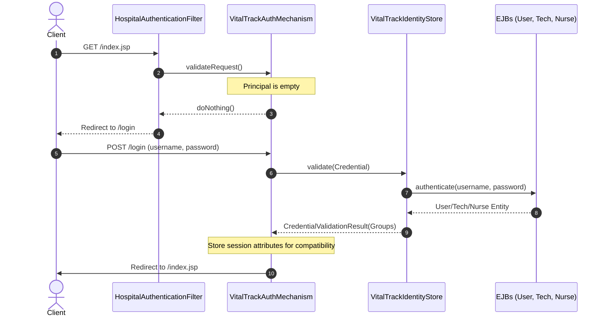

# Implementation Plan: Jakarta Security Integration

To align with the standard JEE patterns, we will transition VitalTrack's manual authentication to **Jakarta Security** (JSR 375). This is the standard, modern security API for Jakarta EE.

---

## 1. Architectural Concepts

Jakarta Security simplifies security through two core components:
1. **`IdentityStore`**: A CDI bean that validates credentials (e.g., username/password) and returns caller identities and group memberships.
2. **`HttpAuthenticationMechanism`**: A CDI bean that orchestrates the HTTP handshake (intercepting login requests, verifying active sessions, initiating standard redirects).

WildFly automatically registers these CDI beans at deploy-time, eliminating legacy XML-based security configuration.

---

## 2. Design Strategy

To implement this with minimal friction and maximum compatibility:
- We will write a custom `VitalTrackIdentityStore` that delegates credential lookup to our existing EJB service layer (`UserEJB`, `HospitalTechnicianEJB`, `HospitalNurseEJB`).
- We will write a custom `VitalTrackAuthMechanism` implementing `HttpAuthenticationMechanism`. This mechanism will:
  - Intercept logins (`POST /login`).
  - Bridge session credentials to request principal contexts.
  - Automatically populate legacy session attributes (`role`, `username`, `loggedInUser`) to maintain 100% backward compatibility with our JSP files and action controllers.
  - Handle temporary password redirects (`/set-password.jsp`).
- We will simplify the `LoginAction` servlet to delegate all validation and logout behaviors directly to standard servlet requests (`req.logout()`).
- We will update the `HospitalAuthenticationFilter` to verify authentications using the standard `req.getUserPrincipal() != null`.

---

## 3. Detailed Steps

### Step 1: Create `VitalTrackIdentityStore.java`
Create the identity store inside `app.security` package. It will query the EJBs to authenticate credentials.

### Step 2: Create `VitalTrackAuthMechanism.java`
Create the HTTP authentication mechanism in `app.security`. It handles logins and logouts, updates the security context, and sets session values.

### Step 3: Refactor `LoginAction.java`
Remove the duplicate authentication logic. Delegate `/logout` to the standard `HttpServletRequest.logout()`.

### Step 4: Update `HospitalAuthenticationFilter.java`
Modify the authentication check to utilize `req.getUserPrincipal() != null`.

### Step 5: Verify Build and Deploy
Execute `mvn clean compile` to ensure there are no compilation issues.
