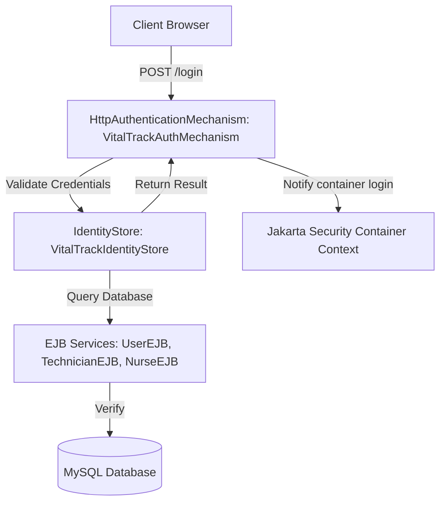

# Presentation Guide: Jakarta Security Integration in VitalTrack

This guide provides a detailed breakdown of the Jakarta Security implementation. Use these talking points, diagrams, and concepts to deliver a clear, expert-level presentation to your trainer.

---

## 1. The Core Objective
We migrated from **manual, custom session-based security** to **standardized Jakarta Security (JSR 375)**. 

### Old Way (Manual Servlet Filter)
- Authentication was handled manually inside `LoginAction.java` by verifying credentials and placing objects in the session.
- Authorization was manually enforced by reading string session variables inside a custom Servlet Filter (`HospitalAuthenticationFilter`) and framework dispatcher.
- **Drawbacks**: Hard to scale, not standardized, and does not integrate with standard Jakarta EE container features (like `request.getUserPrincipal()`, `@RolesAllowed`, or container-level audits).

### New Way (Jakarta Security)
- Security is handled natively by the Jakarta EE container (WildFly).
- Clean separation of concerns between **how** the user authenticates (Mechanism) and **where** the credentials are verified (Identity Store).
- Standardized container context, meaning we can use `HttpServletRequest.getUserPrincipal()` and `HttpServletRequest.isUserInRole()`.

---

## 2. Architectural Components



### A. The Identity Store (`VitalTrackIdentityStore`)
- **Role**: This is the data-retrieval layer. It knows how to talk to our database to verify if a username and password match.
- **Implementation**:
  - Injects our existing transactional database EJBs (`UserEJB`, `HospitalTechnicianEJB`, and `HospitalNurseEJB`).
  - Queries them sequentially (first checking if the user is an Admin, then a Technician, then a Nurse).
  - If a match is found, it returns a `CredentialValidationResult` containing the user's name and their group/role (e.g. `ADMIN`, `TECHNICIAN`, `NURSE`).

### B. The Authentication Mechanism (`VitalTrackAuthMechanism`)
- **Role**: This acts as the HTTP entry point. It orchestrates the login flow.
- **Implementation**:
  - Annotated with `@AutoApplySession` so WildFly remembers the logged-in user in subsequent HTTP requests automatically.
  - Intercepts the login request (`POST /login`), extracts the username and password parameters, and calls the identity store.
  - On successful validation, it alerts the container using `httpMessageContext.notifyContainerAboutLogin(...)`.
  - **The "Bridge" Strategy**: To ensure we didn't break any of our existing views or JSP files that read legacy session attributes, the mechanism automatically populates session attributes (`role`, `username`, `loggedInUser`) alongside container-level authentication.
  - It also handles first-time password checks and redirects users to `/set-password.jsp` if they are using temporary credentials.

---

## 3. The WildFly Elytron Configuration Fix
During deployment, we encountered the error:
`ELY01177: Authorization failed`

### Why did it happen?
1. **Elytron** is WildFly's modern security subsystem. By default, it operates in **Integrated JASPI** mode (`integrated-jaspi=true`).
2. When our Jakarta Security mechanism called `notifyContainerAboutLogin` to dynamically register the authenticated user, WildFly intercepted it and tried to look up that user's credentials statically inside the server's security realms (like `ApplicationDomain` files).
3. Since our users are dynamic (stored in the application's MySQL database and not configured statically in the server's XML/properties files), Elytron rejected the authorization request.

### How did we solve it?
We ran a WildFly CLI command to set `integrated-jaspi` to `false` for the default `other` application security domain:
```bash
/subsystem=undertow/application-security-domain=other:write-attribute(name=integrated-jaspi,value=false)
reload
```
This tells WildFly Elytron: *"Delegate the credential validation and principal creation fully to the application's JASPIC / Jakarta Security mechanism, and trust the identities it produces."*

---

## 4. Key Takeaways for the Presentation
1. **Standards-Based**: The code uses standard Jakarta EE classes, making it highly portable to other servers (like GlassFish, Payara, or Open Liberty).
2. **Clean Separation**: Business logic is separated from HTTP request handling. The EJB does database lookups, the IdentityStore translates it to security credentials, and the Mechanism manages the HTTP lifecycle.
3. **No Legacy XML Config**: We avoided editing complex XML deployment descriptors (`web.xml`, `glassfish-web.xml`, etc.) by using modern annotations like `@AutoApplySession` and `@ApplicationScoped`.
